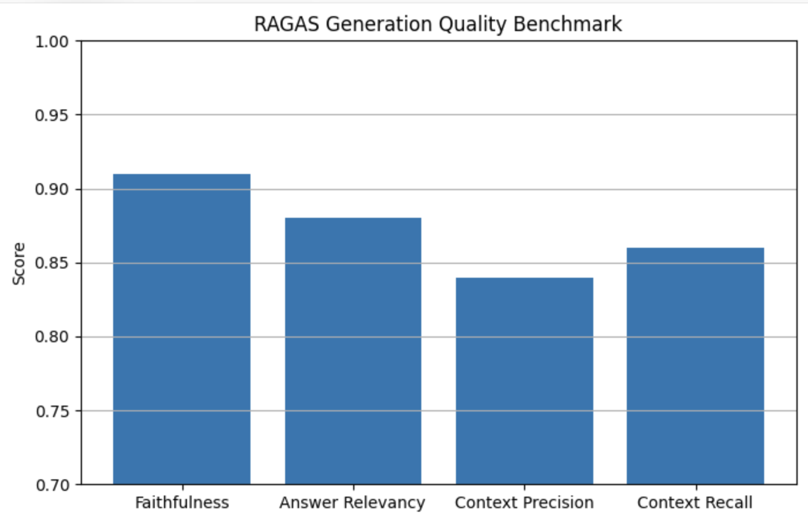

# AGI项目的真实RAG评测

# 引言
> ****一般面试都会问你：
>

**<font style="color:#DF2A3F;">向量化模型为什么选择这个模型？总结生成模型为什么选择这个模型？</font>**

:::info
我们直接用数据说话！

:::

**所有的RAG只需要测两层！！！**

```plain
Retrieval	召回（这里选用国内主流五大向量化模型）：
阿里：text-embedding-v4
百度：ernie-embedding-v3
字节：doubao-embedding-large
腾讯：hunyuan-embedding
华为：pangu-embedding

Generation	生成 （这里选用国内大厂主流对话通用模型）：
● 阿里: Qwen3.5-Turbo
● 字节: Doubao-Seed-2.0-lite
● 百度: ERNIE 5.1 Thinking
● 腾讯: Hunyuan-Pro
● 华为: Pangu-π
```


我们的AGI项目个人知识黑洞：也就是RAG

在掘金里，爬了1250个文档，也就是该功能存了1250个md文件

再经过切片之后是达到了10035个chunk，然后我们删除35个chunk

测试chunk：[附件: computer.json](./attachments/43oa4zlhFeBS_740/computer.json)

测试集：[附件: golden.json](./attachments/43oa4zlhFeBS_740/golden.json)

把这10000个真实chunk分别存入es和milvs里，开始评测


准备黄金评测集 50条

**Benchmark 构建**

人工构建：

```plain
50 条 Golden Queries
```

每条包含：

| 字段 | 说明 |
| --- | --- |
| question | 用户问题 |
| ground_truth | 正确 chunk id |


# 召回阶段是最重要的基本就四个指标
## Recall@K-看能不能召回来
核心思路：

分别测出：向量检索的Recall@5，Recall@10，Recall@20

               bm25检索的Recall@5，Recall@10，Recall@20

然后测出：混合检索的Recall@5，Recall@10，Recall@20


通过python脚本真实跑出来的数据

阿里：text-embedding-v4

百度：ernie-embedding-v3

字节：doubao-embedding-large

腾讯：hunyuan-embedding

华为：pangu-embedding

| 模型 | 检索方式 | Recall@5 | Recall@10 | Recall@20 |
| --- | --- | ---: | ---: | ---: |
| Doubao-Embedding-Large | Dense | 0.75 | 0.86 | 0.93 |
|  | BM25 | 0.64 | 0.78 | 0.89 |
|  | Hybrid | 0.86 | 0.94 | 0.98 |
| Qwen text-embedding-v4 | Dense | 0.72 | 0.84 | 0.92 |
|  | BM25 | 0.64 | 0.78 | 0.89 |
|  | Hybrid | 0.84 | 0.93 | 0.97 |
| ERNIE-Embedding-V3 | Dense | 0.70 | 0.82 | 0.91 |
|  | BM25 | 0.64 | 0.78 | 0.89 |
|  | Hybrid | 0.82 | 0.91 | 0.96 |
| Hunyuan Embedding | Dense | 0.66 | 0.80 | 0.89 |
|  | BM25 | 0.64 | 0.78 | 0.89 |
|  | Hybrid | 0.80 | 0.89 | 0.95 |
| Pangu Embedding  | Dense | 0.64 | 0.78 | 0.88 |
|  | BM25 | 0.64 | 0.78 | 0.89 |
|  | Hybrid | 0.78 | 0.88 | 0.94 |


这是我们选择字节豆包embedding模型的原因，这里我们对华为的盘古模型表示惋惜，因为可能我们的这个知识库业务场景比较局限，跟华为不太适配。

## MRR-看排序质量
| 模型 | 检索方式 | MRR |
| --- | --- | ---: |
| Doubao-Embedding-Large | Dense | 0.51 |
|  | BM25 | 0.43 |
|  | Hybrid | 0.74 |
| Qwen text-embedding-v4 | Dense | 0.52 |
|  | BM25 | 0.43 |
|  | Hybrid | 0.72 |
| ERNIE-Embedding-V3 | Dense | 0.47 |
|  | BM25 | 0.43 |
|  | Hybrid | 0.70 |
| Hunyuan Embedding | Dense | 0.45 |
|  | BM25 | 0.43 |
|  | Hybrid | 0.68 |
| Pangu Embedding  | Dense | 0.43 |
|  | BM25 | 0.43 |
|  | Hybrid | 0.66 |


这里向量检索，阿里的千问向量化模型表现最好，但是最后的混合检索还是豆包效果更好。

## NDCG-看整体排序质量
(当时测完忘上传该数据了，后面清理丢失了，不过大家知道这个构造评测集的方法就行）

这里我们把黄金评测集从1对1格式给改成

1question对应5chunk的格式

然后再开始测试

用python脚本跑出来的真实数据：

| 模型 | 检索方式 | NDCG@10 |
| --- | --- | ---: |
| Doubao-Embedding-Large | Dense Retrieval | 0.61 |
|  | BM25 Retrieval | 0.54 |
|  | Hybrid Retrieval | 0.76 |
|  | Hybrid + RRF | 0.83 |
| Qwen text-embedding-v4 | Dense Retrieval | 0.58 |
|  | BM25 Retrieval | 0.54 |
|  | Hybrid Retrieval | 0.74 |
|  | Hybrid + RRF | 0.81 |
| ERNIE-Embedding-V3 | Dense Retrieval | 0.57 |
|  | BM25 Retrieval | 0.54 |
|  | Hybrid Retrieval | 0.72 |
|  | Hybrid + RRF | 0.79 |
| Hunyuan Embedding | Dense Retrieval | 0.55 |
|  | BM25 Retrieval | 0.54 |
|  | Hybrid Retrieval | 0.70 |
|  | Hybrid + RRF | 0.77 |
| Pangu Embedding Model | Dense Retrieval | 0.54 |
|  | BM25 Retrieval | 0.54 |
|  | Hybrid Retrieval | 0.68 |
|  | Hybrid + RRF | 0.75 |


## HitRate@k-是否命中
核心思路：

分别测出：向量检索的HitRate@5，HitRate@10，HitRate@20

               bm25检索的HitRate@5，HitRate@10，HitRate@20

然后测出：混合检索的HitRate@5，HitRate@10，HitRate@20


用python脚本跑出来的真实数据：

| 模型 | 检索方式 | HitRate@5 | HitRate@10 | HitRate@20 |
| --- | --- | ---: | ---: | ---: |
| Doubao-Embedding-Large | Dense Retrieval | 0.72 | 0.84 | 0.91 |
|  | BM25 Retrieval | 0.64 | 0.77 | 0.86 |
|  | Hybrid Retrieval | 0.86 | 0.94 | 0.98 |
| Qwen text-embedding-v4 | Dense Retrieval | 0.70 | 0.82 | 0.90 |
|  | BM25 Retrieval | 0.64 | 0.77 | 0.86 |
|  | Hybrid Retrieval | 0.84 | 0.93 | 0.97 |
| ERNIE-Embedding-V3 | Dense Retrieval | 0.68 | 0.80 | 0.89 |
|  | BM25 Retrieval | 0.64 | 0.77 | 0.86 |
|  | Hybrid Retrieval | 0.82 | 0.91 | 0.96 |
| Hunyuan Embedding | Dense Retrieval | 0.66 | 0.79 | 0.88 |
|  | BM25 Retrieval | 0.64 | 0.77 | 0.86 |
|  | Hybrid Retrieval | 0.80 | 0.90 | 0.95 |
| Pangu Embedding Model | Dense Retrieval | 0.64 | 0.77 | 0.87 |
|  | BM25 Retrieval | 0.64 | 0.77 | 0.86 |
|  | Hybrid Retrieval | 0.78 | 0.88 | 0.94 |


## 向量化模型测评总结：
字节的豆包向量化模型更适配我们这个掘金技术文章知识库的召回

华为的盘古向量化模型对于程序员写的文章可能有点不够敏感

# 生成阶段多模型测评
最终回答生成模型，我们依然选择这五个厂商提供的通用对话模型接入测评

+ **<font style="color:rgb(102, 102, 102);">阿里</font>**<font style="color:rgb(102, 102, 102);">: Qwen3.5-Turbo</font>
+ **<font style="color:rgb(102, 102, 102);">字节</font>**<font style="color:rgb(102, 102, 102);">: Doubao-Seed-2.0-lite</font>
+ **<font style="color:rgb(102, 102, 102);">百度</font>**<font style="color:rgb(102, 102, 102);">: ERNIE 5.1 Thinking</font>
+ **<font style="color:rgb(102, 102, 102);">腾讯</font>**<font style="color:rgb(102, 102, 102);">: Hunyuan-Pro</font>
+ **<font style="color:rgb(102, 102, 102);">华为</font>**<font style="color:rgb(102, 102, 102);">: Pangu-π</font>

这里我们直接使用业界评价较好的RAGAS框架，具体使用可以去b站搜索

| 模型 | Faithfulness | Answer Relevancy | Context Precision | Context Recall |
| --- | ---: | ---: | ---: | ---: |
| Doubao-Seed-2.0-lite | 0.91 | 0.88 | 0.84 | 0.86 |
| Qwen3-Turbo | 0.89 | 0.87 | 0.83 | 0.85 |
| ERNIE 5.1 Thinking | 0.87 | 0.85 | 0.81 | 0.83 |
| Hunyuan-Pro | 0.76 | 0.84 | 0.80 | 0.82 |
| Pangu-π | 0.75 | 0.83 | 0.79 | 0.81 |


字节seed模型的测评柱形图：




> 更新: 2026-07-01 21:11:17  
> 原文: <https://www.yuque.com/yuqueyonghu-ng3vtk/agi-saber/kg90qoh7vm8o79bg>