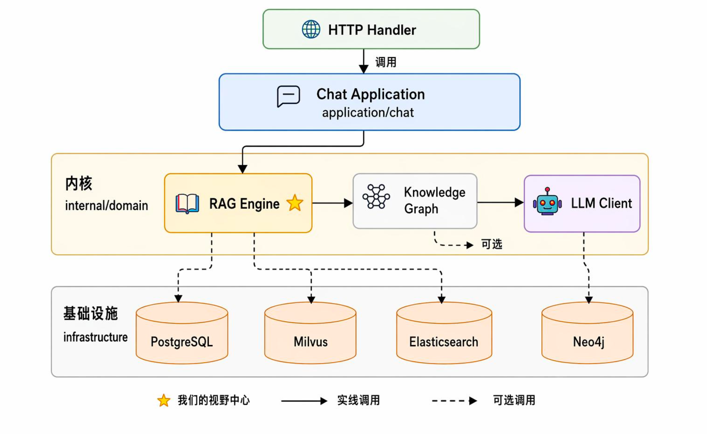
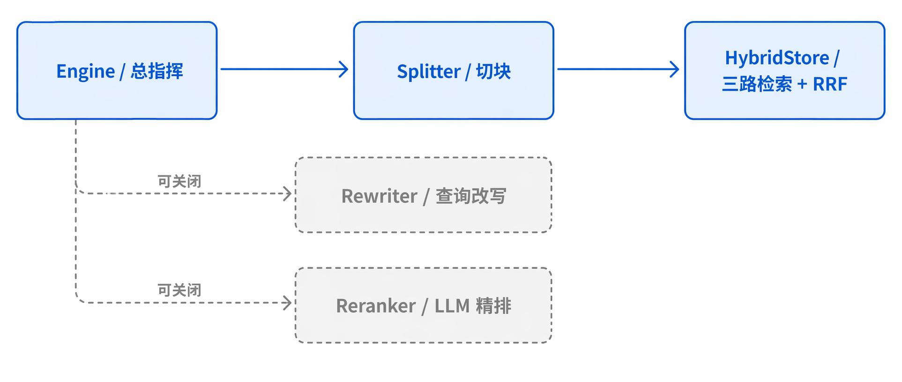
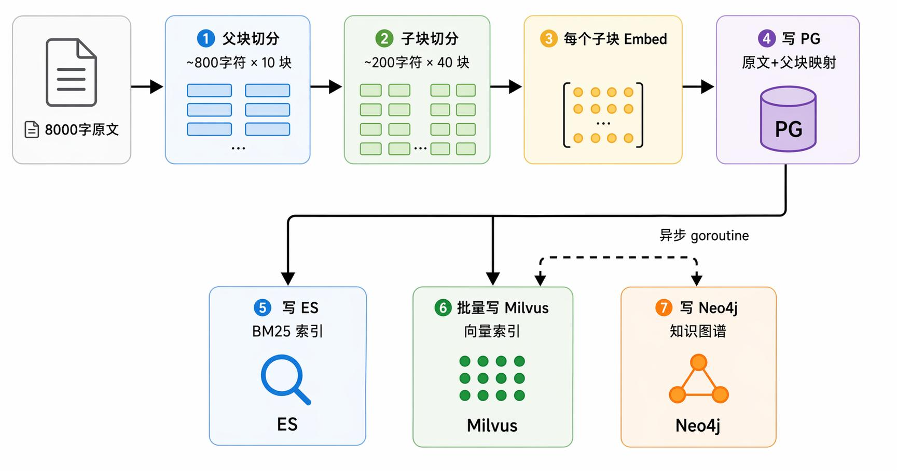
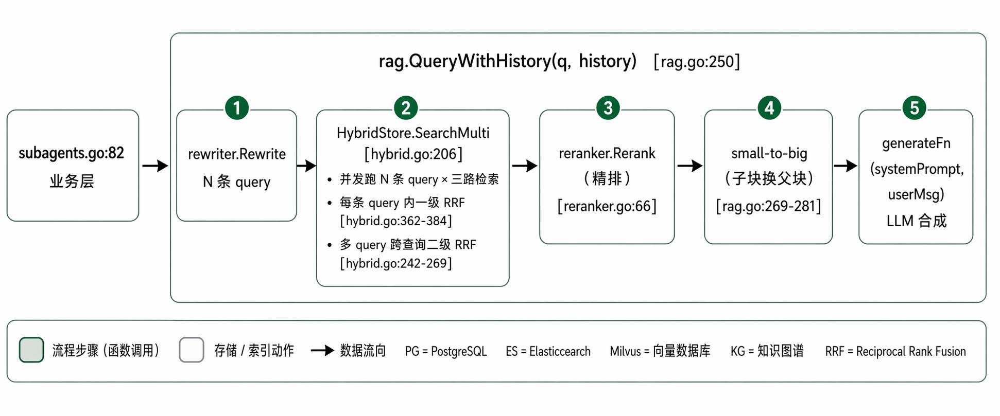
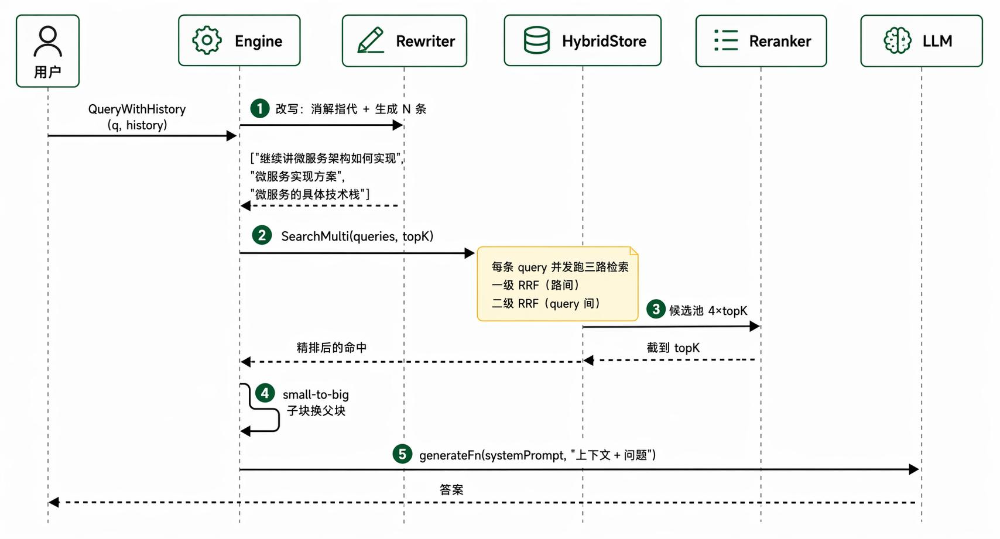
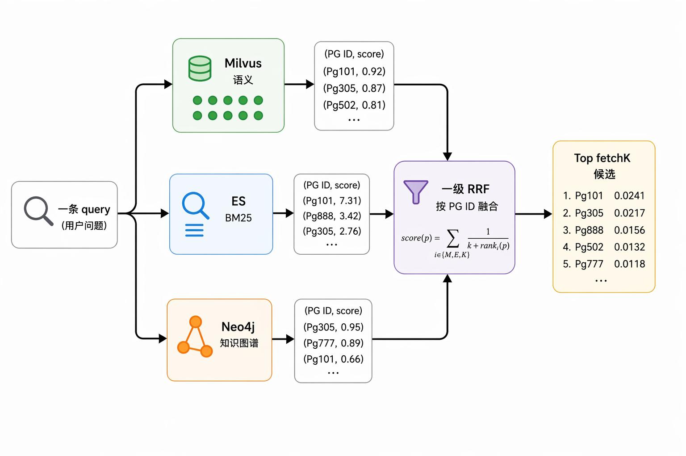
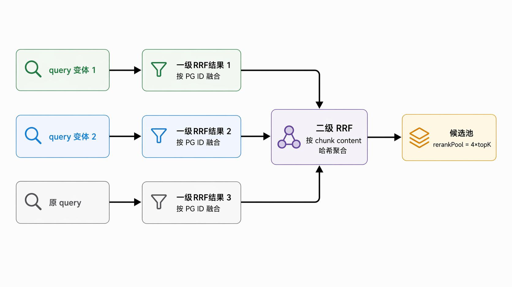

# RAG模块详细讲解

## 前置知识

可以按需阅读以下文章 以便更好的学习RAG模块

* \[RAG基础概念]\(https://www.yuque.com/yuqueyonghu-ng3vtk/agi-saber/nb06398h2sok5gqk?singleDoc# 《RAG基础概念》)
* \[RAG基础结构]\(https://www.yuque.com/yuqueyonghu-ng3vtk/agi-saber/ndhqqg31gncdhp40?singleDoc# 《RAG基础结构》)
* \[多路召回设计]\(https://www.yuque.com/yuqueyonghu-ng3vtk/agi-saber/sxcaubb0i35oc0bt?singleDoc# 《多路召回设计》)
* [工业级的 RAG 优化选型](https://www.yuque.com/yuqueyonghu-ng3vtk/agi-saber/msmg7ofigme68bf6)
* \[父子索引是什么，解决了什么问题]\(https://www.yuque.com/yuqueyonghu-ng3vtk/agi-saber/iq2q46801rgxqg23?singleDoc# 《父子索引是什么，解决了什么问题》)
* \[RAG—动态TOP K算法]\(https://www.yuque.com/yuqueyonghu-ng3vtk/agi-saber/uhc2v0e4odpf8gmh?singleDoc# 《RAG—动态TOP K算法》)

## RAG 在 Saber 项目的位置

**整个项目大致分四层：**

* HTTP 接口
* 应用层（chat）
* 领域层（domain）
* 基础设施（infrastructure）

*<font style="color:#DF2A3F;">RAG 模块是</font>\_\_**<font style="color:#DF2A3F;">领域层的一个子包</font>***<code>_<font style="color:#DF2A3F;">internal/domain/rag</font>_</code>*<font style="color:#DF2A3F;"> 下图标了一颗 </font>**<font style="color:#DF2A3F;">⭐</font>**<font style="color:#DF2A3F;"> 表示"我们的视野中心"：</font>*



## 五大组件分工

***打开 internal/domain/rag/ 目录，5 个核心 .go 文件就是**\_\_**<font style="color:#DF2A3F;">"你将来面试会被问到的全部"：</font>***

```go
internal/domain/rag/
├── rag.go         # Engine：对外门面
├── splitter.go    # 切分（父块 + 子块 + 代码块保护）
├── hybrid.go      # 混合检索（Milvus + ES + Neo4j + RRF）
├── rewriter.go    # Query 改写
└── reranker.go    # 精排
```

| 组件 | 文件 | 一句话职责 | 类比 |
| --- | --- | --- | --- |
| **Engine** | rag.go | 对外暴露 Ingest / QueryWithHistory，编排全流程 | 餐厅大堂经理 |
| **Splitter** | splitter.go | 把长文档切成父块 + 子块（递归 + 代码块保护） | 把书撕成便利贴 |
| **HybridStore** | hybrid.go | 三路混合检索 + 一级 RRF + 二级 RRF + 模式降级 | 投票合议庭 |
| **Rewriter** | rewriter.go | 改写用户问题成 N 条等价 query（消歧 + 多样化） | 把口语翻译成书面问题 |
| **Reranker** | reranker.go | LLM listwise 给候选段落打 0-10 分精排 | 评委二次复评 |



## ***上传一篇文档 - 喂资料（Ingest注入 向量化）***

**设想用户上传了一篇 8000 字的《2024 公司报销制度.md》。它会被这样处理：**

***



\*\*代码入口在 rag.go#L160-L204 的 **<code>**Ingest**</code>** / \*\*<code>**IngestWithMetadata**</code>

### **下面 5 步逐步拆：**

#### ***step 1: 父块切分（~800 字符）***

\_**<font style="color:#DF2A3F;">这一步在干嘛？\ </font>**\_把整篇文章先按"语义大段"切成 ~800 字符的块。这些大块**不是用来检索的**，而是**用来给 LLM 看的**——后面"small-to-big"环节会用到。、

**<font style="color:#000000;">代码在 rag.go#L165：</font>**

```go
parents := e.parentSplitter.Split(doc)
```

**<font style="color:#000000;">父块大小怎么定的？看 rag.go#L108-L122 的 </font>**<code>**<font style="color:#000000;">NewEngine</font>**</code>**<font style="color:#000000;">：</font>**

```go
parentSize := cfg.ChunkSize * 4
if parentSize < 600 {
    parentSize = 600
}
parentOverlap := cfg.ChunkOverlap * 2
```

***<font style="color:#DF2A3F;">为什么是 4 倍？ </font>***

* 这是经验值：父块要"保持语义完整"足够大，但不能大到把 LLM 上下文窗口塞爆。子块默认 200，4 倍 = 800，再保底 600，就是个工程上的折中。
* 为什么 overlap 也加倍？ 因为父块更长，块之间的语义衔接点多，重叠比例保持一致需要更多 overlap 字符。

#### *step 2: 子块切分（~200 字符）*

***<font style="color:#DF2A3F;">这一步在干嘛？</font>***\
把每个父块再切成更精细的小块（默认 200 字符）。**<font style="color:#DF2A3F;">这些小块才是真正用来检索的</font>**。

**代码在 rag.go#L168-L176：**

```go
var allChildren []Chunk
var childToParent []string
for _, p := range parents {
    children := e.childSplitter.Split(p.Content)
    for _, c := range children {
        c.ID = len(allChildren) // 全局重新编号
        allChildren = append(allChildren, c)
        childToParent = append(childToParent, p.Content)  // 记下"我的爸爸是谁"
    }
}
```

***<font style="color:#DF2A3F;">注意 </font>***<code>_**<font style="color:#DF2A3F;">childToParent</font>**_</code>***<font style="color:#DF2A3F;"> 这个数组——它把每个子块映射到"它来自哪个父块"，这是后面 small-to-big 的物理基础。</font>***

##### ***切分算法的"语义降级"思路（重点）***

***<font style="color:#DF2A3F;">为什么不直接按 200 字符硬切？</font>***

**因为那会把句子从中间撕开，比如："公司差旅每日补贴标准为，市内 200 元跨省 500 元，需保留发票原件。" 被切成两块：**

```plain
[块 A] "公司差旅每日补贴标准为，市内 200 元"
[块 B] "跨省 500 元，需保留发票原件。"
```

LLM 拿到块 A 会以为补贴只到市内。这就是硬切的语义破坏。

本项目用的是递归切分 + 语义降级：先尝试用最强的分隔符（标题）切，子片段还超长就降级到段落，再降级到句号、逗号、空格、最后字符兜底。源码在 splitter.go#L75-85：

```go
var defaultSeparators = []string{
    "\n## ", "\n### ", "\n#### ", "\n# ",   // ① Markdown 标题
    "\n\n",                                   // ② 段落
    "\n",                                     // ③ 行
    "。", "！", "？",                         // ④ 中文句末
    ". ", "! ", "? ",                         // ⑤ 英文句末（带空格避免误切小数）
    "；", "; ",                                // ⑥ 分号
    "，", ", ",                                // ⑦ 逗号
    " ",                                      // ⑧ 空格
    "",                                       // ⑨ 字符级硬切（兜底）
}
```

*\*\*递归切的逻辑在 splitter.go#L164-197 的 \*\**<code>_**recursiveSplit**_</code>***：***

```go
func (s *RecursiveSplitter) recursiveSplit(text string, seps []string) []string {
    if runeLen(text) <= s.chunkSize { return []string{text} }
    sep := seps[0]
    parts := splitKeepingSep(text, sep)
    var out []string
    for _, p := range parts {
        if runeLen(p) <= s.chunkSize {
            out = append(out, p)
            continue
        }
        out = append(out, s.recursiveSplit(p, seps[1:])...)  // ← 还超长，降级
    }
    return out
}
```

***<font style="color:#DF2A3F;">形象类比：</font>*****<font style="color:#DF2A3F;">就像给一根法棍切片</font>*****<font style="color:#DF2A3F;">——先找天然的"切口"（标题），切了发现还是太长，再找小切口（段落），还长就找句号……最后实在没切口了才用刀按厘米硬切。</font>***

##### ***代码块保护（亮点）***

***技术文档里经常有代码块：***

````python
这是一段说明文字。
```python
def foo():
    return bar()
````

后面继续说明。

````

_**如果代码块从中间切开，那 LLM 看到的就是"半截 Python 函数"，毫无用处。本项目的解法是：**_**把成对的 **`**```**`** 当原子单元，整个代码块再长也不切**_**。**_

_**源码 splitter.go#L140-161 的 **_`_**protectCodeBlocks**_`_**：**_

```go
func (s *RecursiveSplitter) protectCodeBlocks(text string) []atom {
    idxs := codeFenceRe.FindAllStringIndex(text, -1)
    if len(idxs) < 2 { return []atom{{text: text}} }
    var atoms []atom
    cursor := 0
    for i := 0; i+1 < len(idxs); i += 2 {
        open := idxs[i][0]
        close := idxs[i+1][1]
        if open > cursor { atoms = append(atoms, atom{text: text[cursor:open]}) }
        atoms = append(atoms, atom{text: text[open:close], atomic: true})  // ← 不可切
        cursor = close
    }
    // ...
    return atoms
}
````

***<font style="color:#DF2A3F;">这是面试时一个</font>*****<font style="color:#DF2A3F;">很好的 talk track</font>*****<font style="color:#DF2A3F;">：「我们处理技术文档时把 </font>***<code>_**<font style="color:#DF2A3F;">```</font>**_</code>***<font style="color:#DF2A3F;"> 代码块标记为原子单元，避免切分破坏代码语义」。</font>***

#### ***step 3-6: 多路存储一起写***

切完之后，每个子块要被写到 4 个地方。我们一气讲完，因为它们的代码都在同一个函数 hybrid.go#L105-170 的 `IndexWithParentsAndMetadata`。

##### step 3：每个子块 Embed

```go
var emb []float64
if hs.embedFn != nil {
    emb, _ = hs.embedFn(c.Content)  // 调 LLM 的 embedding 接口
}
```

注意 `hs.embedFn` 是**回调**——不是 import llm 包来调的。这就是第 4 章会讲的"反向依赖注入"。

##### step 4：写 PostgreSQL（**老底**）

```go
pgID, err := hs.chunks.SavePGWithMetadata(docHash, i, c.Content, parentContent, embJSON, ragchunk.Metadata{
    DocumentID: metadata.DocumentID,
    VersionID:  metadata.VersionID,
    Section:    metadata.Section,
})
```

hybrid.go#L132-141。**关键设计**：每条子块行里都直接存了它的**父块原文**（`parentContent`）。后面 small-to-big 不需要再 join 表，PG 一次查询就能拿到子+父两份内容。

为什么 PG 是"老底"？因为它是 RAG 唯一的"事实真相源（source of truth）"。Milvus / ES 都只是它的派生索引，丢了可以从 PG 重建。所以 hybrid.go#L42-44 写：「PG 不可用直接 mode=unavailable」——没有事实源，就玩不下去。

##### step 5：写 Elasticsearch（逐条）

```go
if hs.chunks.ESAvailable() {
    if err := hs.chunks.IndexES(pgID, c.Content, docHash, i); err != nil {
        log.Printf("⚠️  RAG chunk 索引到 ES 失败 (pg_id=%d): %v", pgID, err)
    }
}
```

hybrid.go#L144-149。注意写失败**只打 log 不 return error**——主链路继续跑，只是这条 chunk 在 ES 里查不到（仍然能从 Milvus 查到）。这是优雅降级的另一种形态。

##### step 6：批量写 Milvus

```go

if hs.chunks.MilvusAvailable() && len(emb) > 0 {
    pgIDs = append(pgIDs, pgID)
    contents = append(contents, c.Content)
    embeddings = append(embeddings, emb32)
}
// ↓ 循环结束后批量插入
if len(pgIDs) > 0 {
    if err := hs.chunks.InsertMilvus(pgIDs, contents, embeddings); err != nil {
        log.Printf("⚠️  RAG chunks 写入 Milvus 失败: %v", err)
    }
}
```

hybrid.go#L151-168。**为什么 Milvus 用批量、ES 用逐条？** 因为 Milvus 单条插入有 RPC 开销，1000 条逐条要 ~10 秒；批量降到 ~1 秒。ES 没那么强烈的批量收益，逐条写代码更简单。

#### step 7: 异步写 Neo4j（KG）

主流程已经返回了，KG 才在另一个 goroutine 里慢慢建图。代码 rag.go#L186-195：

```go
if e.kg != nil && e.kg.Available() && len(indexed) > 0 {
    refs := make([]knowledge.ChunkRef, len(indexed))
    for i, c := range indexed {
        refs[i] = knowledge.ChunkRef{ID: c.ID, PGID: c.PGID, Content: c.Content}
    }
    goSafe("rag.kg-index", func() { e.kg.IndexDocument(docHash, refs) })
}
```

**为什么异步？** KG 建图要再调 LLM 抽取实体关系，单文档耗时可能 5-30 秒。如果同步，用户上传文档的 HTTP 请求就超时了。

**为什么是 goSafe 不是 go？** Neo4j 网络断连或 panic 时，普通的 `go func()` 会让整个 Go 进程挂掉（<font style="color:#DF2A3F;">Go 的规则：goroutine panic 没人 recover 就拖崩主进程）</font>。\
`goSafe` 包了一层 recover，***<font style="color:#DF2A3F;">源码 rag.go#L36-45：</font>***

```go
func goSafe(name string, fn func()) {
    go func() {
        defer func() {
            if r := recover(); r != nil {
                log.Printf("⚠️  goroutine panic [%s]: %v\n%s", name, r, debug.Stack())
            }
        }()
        fn()
    }()
}
```

**关键细节**：传给 `IndexDocument` 的是 `indexed`（含真实 PGID）而不是 `chunks`。\
***<font style="color:#DF2A3F;">为什么？</font>***\
因为 KG 节点要把 `pg_id` 持久化进去——后续检索时三路 RRF 融合需要靠 `pg_id` 把 KG 节点和 PG 行对齐。如果 KG 不存 `pg_id`，KG 召回的实体就和 PG 的 chunk 对不上，融合也就没意义了（详见 hybrid.go#L378-383）。

#### docHash：幂等 + 删除的关键

每次 Ingest 第一步算 docHash（hybrid.go#L107）：

```go
docHash := fmt.Sprintf("%x", sha256.Sum256([]byte(docContent)))[:16]
```

**作用 1：幂等**。同一文档重复上传，docHash 一样，repo 层会去重。\
**作用 2：按文档整体删除**。`Engine.Delete(docHash)` 一次把 PG / ES / Milvus / Neo4j 里这个文档的全部 chunk 都删掉，源码 rag.go#L218-229。

***<font style="color:#DF2A3F;">总结：Ingest 是「父块切 → 子块切 → PG 写老底 → ES/Milvus 同步派生 → Neo4j 异步建图」，切分核心是按语义强度递归降级 + 代码块原子保护。</font>***

## 用户提问（Query改写）



**设定一个具体场景：**

**用户和 Agent 已经聊了几轮，前几句聊到了"我们的微服务架构"。现在用户输入：**

"上面讲的微服务怎么实现的？**"**

***<font style="color:#DF2A3F;">这是一个非常典型的"省略 + 指代"型问题。"上面讲的"指代不明，纯靠这句话本身根本搜不到东西。我们看 RAG 是怎么处理的。</font>***



**主流程入口在 rag.go#L250-301 的 **<code>**QueryWithHistory**</code>**。下面我们 step-by-step 拆。**

### step 1: 改写（Rewriter）

***<font style="color:#DF2A3F;">这一步在干嘛？ </font>***\
把"上面讲的微服务怎么实现的？"这种依赖对话历史的问题，改写成**自包含**的独立查询，并顺手生成几条"措辞不同但语义等价"的变体。

***主流程代码 rag.go#L255-262：***

```go
queries := []string{question}
if e.rewriter != nil {
    rewritten := e.rewriter.Rewrite(question, history)
    if len(rewritten) > 0 {
        queries = rewritten
    }
}
```

***<font style="color:#DF2A3F;">实现在 rewriter.go#L66-114 的 </font>***<code>_**<font style="color:#DF2A3F;">LLMRewriter.Rewrite</font>**_</code>***<font style="color:#DF2A3F;">。它做了三件事：</font>***

1. 把最近 6 轮历史摘要拼到 prompt 里。
2. 调 LLM 让它输出 JSON `{"queries": [...]}`。
3. \*\*解析失败一律 \*\***fallback** 到 `[原查询]`。

***<font style="color:#DF2A3F;">prompt 设计很有讲究 rewriter.go#L52-63：</font>***

```go
1) 先把当前问题改写成一句**自包含的独立查询**（消除指代、补全省略）。
2) 再生成若干条**等价但措辞不同**的查询变体（同义词替换、抽象/具体切换、不同语序）。

输出**严格 JSON**，不要任何说明文字、不要 markdown 代码块：
{"queries": ["独立查询", "变体1", "变体2"]}
```

**关键设计：始终保留原查询**。看 rewriter.go#L103-113：

```go
queries := parseRewriteJSON(raw)
if len(queries) == 0 {
    log.Printf("⚠️  Query rewrite 解析失败，回退原查询...")
    return []string{query}
}
queries = dedupKeepOrder(append(queries, query))  // ← 把原 query 也塞进去
if len(queries) > r.numQueries {
    queries = queries[:r.numQueries]
}
return queries
```

***<font style="color:#DF2A3F;">为什么始终保留原查询？ </font>***\
LLM 改写有可能完全跑偏（比如把"微服务"改写成不相关的"微小服务"），原查询能保底召回。这是工程上的"safety net"思维。

回到我们的例子，三条改写后的 query 大致是：

```go
["继续讲微服务架构如何实现", "微服务实现方案", "上面讲的微服务怎么实现的？"]
```

注意第三条是"原查询"——多保一份。

### step 2-4: 三路检索 + 一级 RRF + 二级 RRF（核心）

**整章最复杂的部分**。我们用两张图把它拆成两层来看。

主流程入口 rag.go#L264-265：

```go
// 2) 多查询并发检索 + 跨查询 RRF 合并 + 可选 rerank（在 store 内部完成）
hybridResults := e.store.SearchMulti(queries, e.cfg.TopK)
```

实现在 hybrid.go#L206-274 的 `SearchMulti`。它分成两层 RRF。

#### 一级 RRF（单条 query 内三路融合）

***<font style="color:#DF2A3F;">每条 query 都单独跑一次"三路检索 + 三路 RRF"：</font>***



**代码在 hybrid.go#L319-434 的 **<code>**searchHybrid**</code>**。核心 RRF 计算在 hybrid.go#L362-384：**

```go
rrfScores := make(map[int64]float64)
for rank, hit := range milvusHits {
    rrfScores[hit.ID] += 1.0 / float64(k+rank+1)
}
for rank, hit := range esHits {
    rrfScores[hit.PGID] += 1.0 / float64(k+rank+1)
}
if hs.kg != nil && hs.kg.Available() {
    kgWeight := hs.cfg.KGWeight
    if kgWeight <= 0 { kgWeight = 1.0 }
    kgHits := hs.kg.Search(query, fetchK)
    for rank, hit := range kgHits {
        if hit.PGID == 0 {  // 老节点没 pg_id，跳过避免污染
            continue
        }
        rrfScores[hit.PGID] += kgWeight / float64(k+rank+1)
    }
}
```

**RRF**\*\* 公式\*\*（必背，面试肯定问）：

**score(d) = Σᵢ wᵢ / (k + rankᵢ(d))**

* `d` = 一条候选文档
* `i` = 第 i 路检索器
* `rankᵢ(d)` = 文档 d 在第 i 路检索结果里排第几（从 0 开始）
* `k` = 平滑常数，默认 60，越大越削弱前几名优势
* `wᵢ` = 第 i 路的权重（语义和关键词都是 1.0，KG 用 `cfg.KGWeight`）

**关键性质：只看排名不看分数**

#### 二级 RRF（多 query 跨查询合并）

***<font style="color:#DF2A3F;">一级 RRF 算完一条 query 的结果。但我们有 N 条 query，结果怎么合？</font>***



***<font style="color:#DF2A3F;">代码 hybrid.go#L213-269：</font>***

```go
results := make([]queryResult, len(queries))
var wg sync.WaitGroup
wg.Add(len(queries))
pool := hs.rerankPool(topK)
for i, q := range queries {
    i, q := i, q
    go func() {                                    // ← 多 query 并发
        defer wg.Done()
        results[i] = queryResult{query: q, res: hs.searchOne(q, pool, false)}
    }()
}
wg.Wait()

// 跨查询 RRF 合并
k := hs.cfg.RRFConstantK
if k <= 0 { k = 60 }
merged := make(map[string]*acc, pool)
for _, qr := range results {
    for rank, hr := range qr.res {
        key := hr.Chunk.Content                    // ← 按 chunk 内容聚合
        if a, ok := merged[key]; ok {
            a.score += 1.0 / float64(k+rank+1)
            // ...
        } else {
            // ...
        }
    }
}
```

\*\*为什么需要二级 RRF？\
\*\*Rewriter 生成的 N 条 query 召回的 chunk 大部分相同，但顺序略有差异。简单合并 + 排序会有"重复 + 顺序不稳定"问题。RRF 让"被多条 query 同时命中的 chunk"自然排前——符合用户的潜在意图，因为 N 条 query 都想找它。

#### 候选池 = 4×topK：rerank 需要"宽召回"

hybrid.go#L277-286：

```go
func (hs *HybridStore) rerankPool(topK int) int {
    pool := topK * 2
    if hs.reranker != nil {
        pool = topK * 4   // ← 有精排时召回更宽
    }
    if pool < 10 { pool = 10 }
    return pool
}
```

\_**<font style="color:#DF2A3F;">如果 topK=5，没 reranker 时召回 10 条，有 reranker 时召回 20 条。为什么这么设计？\ </font>**\_rerank 能"精排"但不能"召新"。如果一开始召回的 10 条里就没有正确答案，rerank 再厉害也变不出来。所以**有 rerank 时召回宽一点**，让真实答案有更高概率落进候选池。

### step 5: LLM 精排（Reranker）

***<font style="color:#DF2A3F;">这一步在干嘛？ </font>***\
让 LLM 给候选池里每一条 chunk 打一个 0-10 的分，按分数重排，截到 topK。

***<font style="color:#DF2A3F;">主流程入口 hybrid.go#L289-294：</font>***

```go
func (hs *HybridStore) finalize(query string, results []HybridResult, topK int) []HybridResult {
    if hs.reranker != nil && len(results) > 1 {
        results = hs.reranker.Rerank(query, results, topK)
    } else if topK > 0 && len(results) > topK {
        results = results[:topK]
    }
    return results
}
```

***<font style="color:#DF2A3F;">实现 reranker.go#L66-135 的 </font>***<code>_**<font style="color:#DF2A3F;">LLMReranker.Rerank</font>**_</code>***<font style="color:#DF2A3F;">。Prompt 设计 reranker.go#L47-63：</font>***

```go
你是检索系统的精排器。给定用户问题和若干候选段落（每条带编号 idx），
判断每条段落对回答该问题的**相关性 + 信息密度**，给 0~10 的整数分。

打分准则：
- 10：直接回答了问题
- 7~9：包含明确相关事实
- 4~6：弱相关 / 部分相关
- 1~3：仅出现共现关键词，不能用来回答
- 0：无关 / 噪声

输出**严格 JSON**...
{"scores": [{"idx": 0, "score": 9}, {"idx": 1, "score": 3}, ...]}
```

***<font style="color:#DF2A3F;">PS：注意是 listwise——一次把所有候选给 LLM，让它统一打分。不是 pointwise（一次给一条评分 N 次）。listwise 的好处：LLM 能看到候选间的相对关系，分数尺度一致。</font>***

**关键设计：****LLM**** 分数主排序，原 ****RRF**** 分作 tiebreaker**，reranker.go#L116-121：

```go
sort.SliceStable(pool, func(i, j int) bool {
    if pool[i].llm != pool[j].llm {
        return pool[i].llm > pool[j].llm   // 主：LLM 分
    }
    return pool[i].rrf > pool[j].rrf       // 副：RRF 分（tiebreaker）
})
```

***<font style="color:#DF2A3F;">为什么 RRF 分作 tiebreaker？ </font>***\
LLM 给整数分（0-10），打平时不少。这时让 RRF 来做"深度排序"——因为 RRF 是连续值，几乎不打平。

**另一个关键兜底**reranker.go#L108-114：LLM 漏给某条打分时，给它一个"低分但不是负无穷"的兜底值（-1）。**不丢弃**——避免 LLM 漏判把正确答案删掉。

### step 6: small-to-big 父块回填

***<font style="color:#DF2A3F;">这一步在干嘛？</font>***\*\*\
**之前检索命中的是**子块\*\*（200 字精准命中），但喂给 LLM 看的应该是**父块**（800 字完整上下文）。这一步就是做这个替换。

代码 rag.go#L267-282：

```go
results := make([]SearchResult, 0, len(hybridResults))
var parts []string
for _, hr := range hybridResults {
    // 3) small-to-big：优先用父块原文做上下文
    display := hr.Parent
    if display == "" {
        display = hr.Chunk.Content
    }
    results = append(results, SearchResult{
        Chunk:      Chunk{ID: hr.Chunk.ID, Content: display},
        Similarity: hr.Score,
    })
    if display != "" {
        parts = append(parts, display)
    }
}
```

`hr.Parent` 字段是从 PG 直接查出来的（02 章讲过：每个子块行里都存了它的父块原文）。所以这一步\*\*没有额外 \*\***IO**，纯内存替换。

***<font style="color:#DF2A3F;">为什么不直接用大块检索？</font>***\*\*\
\*\* 关键在 embedding 的特性：

* 把一段 800 字塞进 embedding 模型，输出一个固定维度的向量。
* 这段 800 字里同时讲了 ABC 三件事，向量是**三件事的"语义平均"**。
* 你问 A，问题向量和这个"平均向量"的距离是中等——既不近也不远。
* 而那段 200 字的子块里只讲 A 这一件事，向量集中指向 A，问 A 时它命中得很准。

**所以小块精准命中 + 大块给上下文 = 检索质量和信息量的最佳折衷**。\
***<font style="color:#DF2A3F;">PS：这是 LlamaIndex 在 2023 年提出的 small-to-big 技巧，本项目把它落地成"PG 表里直接存父块原文 + 检索后内存替换"的最简单形态</font>***

### step 7: 拼提示词喂 LLM

**最后一步**：把若干个父块拼成 context，套上 system prompt 和用户问题，调 LLM 生成最终答案

***<font style="color:#DF2A3F;">代码 rag.go#L284-300：</font>***

```go
context := strings.Join(parts, "\n\n")
if context == "" {
    return "知识库中未找到相关内容。", results
}
if e.generateFn != nil {
    systemPrompt := "你是一个基于知识库回答问题的助手。请仅根据提供的上下文内容回答问题，不要编造信息。如果上下文不足以回答，请说明。"
    askQuery := question
    if len(queries) > 0 && queries[0] != "" {
        askQuery = queries[0]   // ← 用独立化后的版本
    }
    userMsg := fmt.Sprintf("上下文：\n%s\n\n问题：%s", context, askQuery)
    answer := e.generateFn(systemPrompt, userMsg)
    return answer, results
}
return fmt.Sprintf("【知识库检索结果】\n%s", context), results
```

**关键细节 1**：\
system prompt 明确要求"仅根据上下文回答，不编造"——这是防 LLM 幻觉的最后一道闸。\
**关键细节 2**：\
`askQuery` 用 Rewriter 的第一条（独立化后的版本），不用原始的"上面讲的微服务……"。因为独立化版本对 LLM 来说更好理解。\
**关键细节 3**：\
`generateFn == nil`（没注入 LLM）时**不会崩**，而是直接把检索原文返回。这是又一处优雅降级。

***<font style="color:#DF2A3F;">总结：Query 是「改写 → 三路检索 → 一级 RRF（路间）→ 二级 RRF（query 间）→ LLM 精排 → small-to-big 父块回填 → 喂 LLM 合成」，每一步失败都有兜底。</font>***


> 更新: 2026-06-30 11:02:14  
> 原文: <https://www.yuque.com/yuqueyonghu-ng3vtk/agi-saber/xneuz8npio5a9nw5>