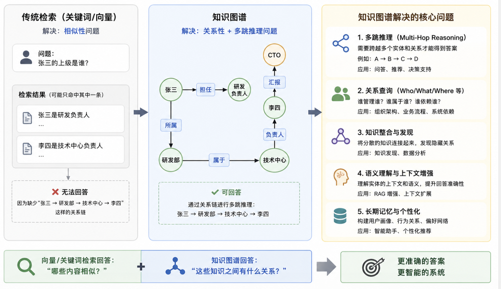
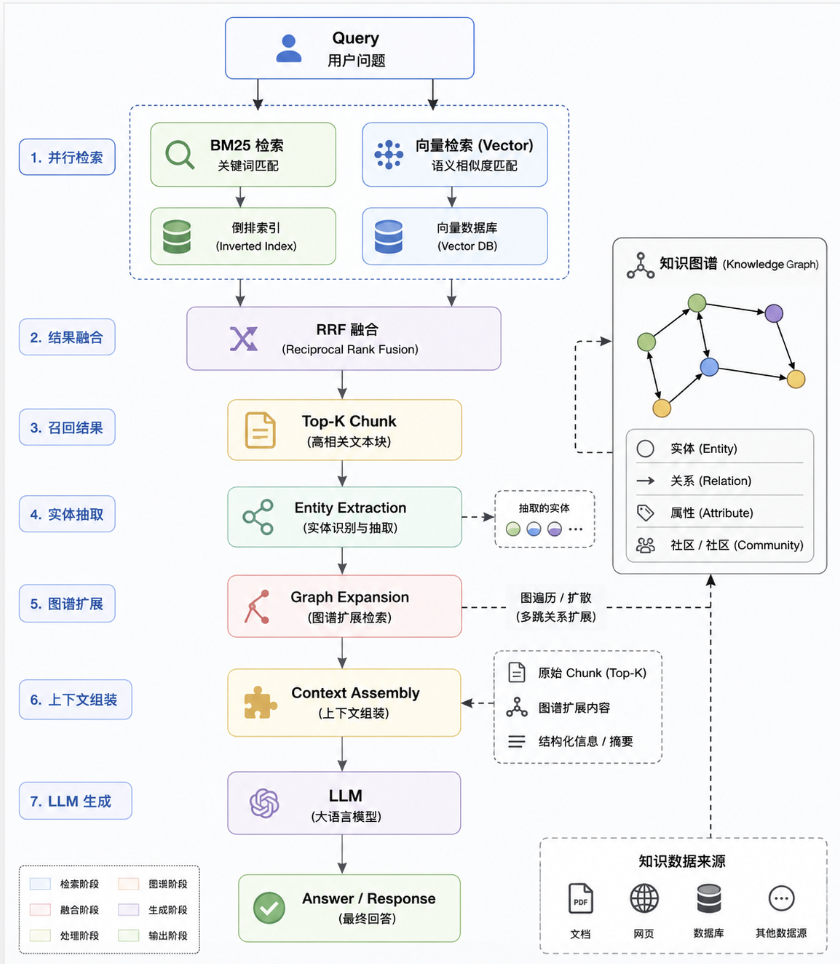

# 为什么rag需要知识图谱

知识图谱是很多 RAG 项目做到后期，数据变巨大都会需要的技术。

**向量检索解决“相似性”，知识图谱解决“关系性”。**

如果你的知识库只有几百篇文档，向量检索 + BM25 基本够用。

但当知识库达到：

+ 几万 Chunk
+ 几十万 Chunk
+ 企业级知识库
+ Agent 长期记忆

就会逐渐暴露问题。

---

# 一、传统 RAG 在干什么
假设知识库里有：

```plain
张三是研发负责人

研发部属于技术中心

技术中心负责人是李四

李四向CTO汇报
```

用户问：

```plain
张三的上级是谁？
```

---

传统 RAG：

### BM25
搜：

```plain
张三 上级
```

找到：

```plain
张三是研发负责人
```

结束。

因为根本没出现：

```plain
张三上级是李四
```

---

### 向量检索
Embedding 后：

```plain
张三
研发负责人
上级
领导
```

可能找到：

```plain
张三是研发负责人
```

或者：

```plain
李四是技术中心负责人
```

但仍然无法推导：

```plain
张三
↓
研发部
↓
技术中心
↓
李四
```

这种多跳关系。

---

# 二、向量检索最大的缺陷
向量本质：

```plain
Query Embedding
      ↓
Chunk Embedding
      ↓
Cosine Similarity
```

它回答的是：

哪个 Chunk 最像这个问题

而不是：

哪些知识之间存在关系

---

例如：

用户问：

```plain
OpenAI 的 CEO 的母校在哪？
```

需要：

```plain
OpenAI
 ↓
CEO
 ↓
Sam Altman
 ↓
Stanford
```

这叫：

### Multi-Hop Reasoning
多跳推理

---

而向量库里：

```plain
Chunk1:
OpenAI CEO 是 Sam Altman

Chunk2:
Sam Altman 曾就读 Stanford
```

两个 Chunk 完全分开。

向量检索可能只召回其中一个。

---

# 三、知识图谱解决什么



---

# 四、为什么 Agent 更需要图谱
RAG 最终会发展成 Memory。

例如用户长期记忆：

```plain
用户喜欢 Rust
用户正在学分布式
用户讨厌八股文
用户在做 Agent-Core
```

如果全部存向量：

```plain
Memory1
Memory2
Memory3
Memory4
```

只是孤立文本。

---

图谱可以变成：

```plain
用户
 ├─喜欢→Rust
 ├─学习→分布式
 ├─开发→Agent-Core
 └─排斥→八股文
```

当用户问：

```plain
给我推荐项目
```

系统能沿图扩散：

```plain
用户
 ↓
Rust
 ↓
分布式
 ↓
Raft
 ↓
存储系统
```

得到更精准的推荐。

这就是很多 Agent Memory 的 Graph Recall 思路。

---

# 五、GraphRAG 为什么火
微软提出的 GraphRAG 核心思想：

不是检索 Chunk。

而是检索：

```plain
实体(Entity)
关系(Relation)
社区(Community)
```

例如文档：

```plain
Apple 发布 iPhone

Tim Cook 发表演讲

A18 芯片由台积电代工
```

抽取：

```plain
Apple
iPhone
Tim Cook
A18
TSMC
```

图：

```plain
Apple
 ├─发布→iPhone
 ├─CEO→Tim Cook
 └─芯片→A18

A18
 └─代工→TSMC
```

用户问：

```plain
苹果手机供应链有哪些关键企业？
```

传统 RAG：

可能召回不到。

GraphRAG：

沿图扩散：

```plain
Apple
→ A18
→ TSMC
```

直接命中。

---

# 六、为什么很多 GraphRAG 效果反而差
因为大家误以为：

```plain
知识图谱 = RAG升级版
```

实际上：

很多问题根本不需要图谱。

例如：

```plain
Transformer是什么？
```

```plain
Self Attention原理？
```

```plain
什么是Redis？
```

这种单跳事实查询：

```plain
BM25 + Dense Retrieval
```

已经接近最优。

---

图谱真正适合：

### 1. 多跳推理
```plain
A -> B -> C
```

---

### 2. 实体关系查询
```plain
谁管理谁
谁属于谁
谁依赖谁
```

---

### 3. 企业知识库
组织架构

业务流程

系统依赖

代码依赖

---

### 4. Agent Memory
用户画像

长期目标

行为关系

计划状态

---

# 七、现在业界的主流方案
实际上很少有人：

```plain
只用知识图谱
```

而是：



也就是：

**关键词召回 + 向量召回负责找知识；知识图谱负责扩展知识。**

这是目前包括微软 GraphRAG、很多企业 Agent Memory 系统采用的思路。

**总结：**

向量检索回答“哪些内容相似”，BM25回答“哪些关键词匹配”，知识图谱回答“这些知识之间是什么关系”。  
小型 RAG 往往不需要图谱；当涉及多跳推理、企业知识库、代码库分析、Agent 长期记忆时，知识图谱的价值才会真正体现出来。


> 更新: 2026-05-31 16:16:42  
> 原文: <https://www.yuque.com/yuqueyonghu-ng3vtk/agi-saber/dfwih2ge2rp3ynp9>