# 从 Static DAG 到 Plan-and-ReAct

## 1. Plan-and-ReAct新增**Replanner**

项目里的 `mode = "react"` 一直被叫作 ReAct，但从调度语义看，它更接近 **Static DAG Plan-and-Execute**：

* Planner LLM 一次性输出全图
* Executor 按拓扑分层并行执行
* Generator LLM 一次性合成答案
* 中间过程**没有 LLM 决策介入**

这与 Yao et al. 2022 定义的 ReAct（Reasoning 与 Acting **交替**循环）在语义上是相反的。为了让这套调度真正具备"看观察 → 决定下一步"的能力，本次改造引入 **Replanner**，把架构从 Static DAG 升级为 **Plan-and-ReAct**（Dynamic DAG）。

## 2. 架构对比

### 2.1 改造前：Static DAG



**问题**：图一旦生成就是死的，中途出错只能靠 retry / race 兜底，不能让 LLM 重新规划。

### 2.2 改造后：Plan-and-ReAct



**关键差异**：Executor 的循环里插入了 Replanner 决策点，让 LLM 能基于 observations 追加节点，实现真正的 "Reasoning + Acting 交替"。

## 3. 调度状态机



## 4. 节点生命周期

单个 Node 的状态流转，Replanner 通过 `AddNodes` 引入的新节点也遵循同一状态机：



## 5. AddNodes 的入度处理

`TaskGraph.AddNodes` 是让图能"活"起来的核心。它需要处理三种依赖场景：



**关键点**：如果新节点依赖的是**已完成**的节点，入度不加，下一轮 `ReadyNodes` 立即返回它——这是"追加立即执行"的机制来源。

## 6. Replanner Prompt 设计

Replanner 与 Planner 的差异不是模型不同，而是**输入与判断规则不同**：

| 维度 | Planner (`llmPlanGraph`) | Replanner (`llmReplan`) |
| --- | --- | --- |
| 输入 | Query + Tool 列表 | Query + Tool 列表 + **当前图快照 + 观察结果** |
| 触发时机 | 请求开始 | 每层执行完 / 节点失败 |
| 输出语义 | 全图 | 增量节点（可为空） |
| 提示词侧重 | "选出需要的工具，标依赖" | "现有观察够不够？不够再补" |
| ID 命名 | `n1, n2, ...` | `r1-*, r2-*, ...`（避免冲突） |

Replanner 的判断规则（写在 prompt 里）：

* 观察已足够 → 返回 `[]`
* 需要基于观察进一步查询/加工 → 追加节点
* 追加节点的 `depends_on` 可以指向图中任何已存在节点 id
* 不重复已有节点做过的事
* 单次最多追加 3 个节点

prompt：

```jsx
prompt := fmt.Sprintf(`你是一个任务重规划器。当前正在执行的任务图部分节点已产生结果，请判断是否需要追加新节点。

用户问题：%s
触发原因：%s
%s
当前图状态（JSON）：
%s

可用工具：
%s

可用子 Agent：
%s

判断规则：
- 如果现有观察已足够回答用户问题，返回 []（不追加）
- 如果需要基于已有观察做进一步查询/加工/汇总，追加节点
- 追加节点的 depends_on 可以指向图中任何已存在的节点 id
- 不要重复已有节点做过的事
- 每次最多追加 3 个节点

以 JSON 数组格式输出（结构与 planner 相同）：
[{"id":"r1","type":"tool","tool":"search_web","params":{...},"reason":"...","depends_on":["n2"],"race_group":""}]
只输出 JSON。`, rc.Query, rc.Reason, failedHint, string(snapJSON),
		strings.Join(toolLines, "\n"), strings.Join(agentLines, "\n"))

```


> 更新: 2026-07-02 00:22:19  
> 原文: <https://www.yuque.com/yuqueyonghu-ng3vtk/agi-saber/ltm0t3337f5k0glu>