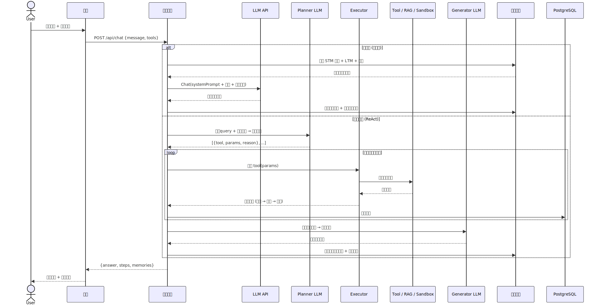
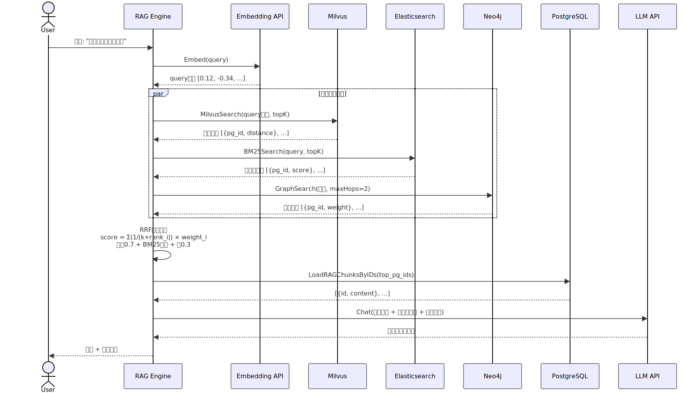
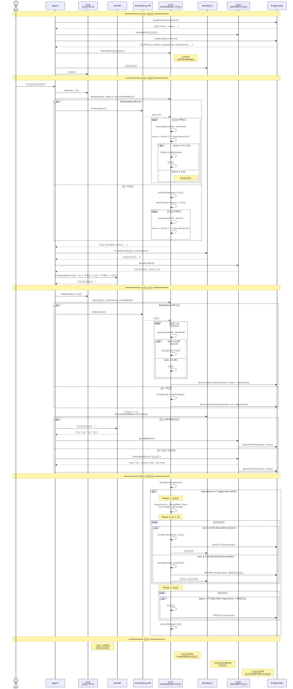

# 架构总览

# AGI-saber：多模态智能体系统

AGI-saber是一个面向个人与企业的多模态智能体系统，融合了检索增强生成（RAG）、三层记忆、知识图谱、沙箱执行与可恢复执行流，支持多轮对话、知识检索、工具调用与复杂推理。系统具备高可用性、可扩展性与工程落地能力。

## 项目特性

* **多阶段智能体核心**：支持纯对话、RAG 检索、单工具调用、多工具编排（ReAct）等多种智能体模式，自动路由。
* **RAG 检索增强生成**：融合 Milvus 语义向量、Elasticsearch 关键词、Neo4j 知识图谱，三路 RRF 融合排序，自动降级，支持文档分块与异步实体关系抽取。
* **三层记忆系统**：短期记忆（滑动窗口）、长期记忆（Embedding/TF）、用户偏好（LLM+规则），支持去重、合并、衰减、过期淘汰。
* **图增强记忆**：长期记忆叠加 Neo4j 图层，支持 FOLLOWS、SIMILAR\_TO、CAUSES、BELONGS\_TO 等关系，提升历史联想与推理能力。
* **工具链与可恢复执行**：内置时间、天气、搜索、RAG 检索、命令执行等工具，支持 ReAct 规划-执行-生成流程，任务快照与重试机制保障稳定性。
* **沙箱执行**：支持 Docker / Local / Mock 三种沙箱后端，资源限制（CPU/内存/PID/网络），命令白名单安全校验。
* **高可用基础设施**：PostgreSQL 持久化、Milvus/ES/Neo4j/Kafka 可选，自动优雅降级，适配多种部署环境。

## 整体架构图



## 核心流程时序图



## RAG 三路混合检索流程图



## 记忆系统详细流程图



## 技术实现亮点

* **RAG 检索增强**：
  * 支持三路混合检索（Milvus 语义向量、ES BM25 关键词、Neo4j 知识图谱），RRF 融合排序。
  * 文本分块采用窗口重叠，提升召回覆盖率。
  * 检索模式自动切换，单路故障自动降级，支持企业级高可用。
  * 检索结果结构化，便于 LLM 合成与追溯。
* **三层记忆系统**：
  * 短期记忆：滑动窗口保存最近 N 轮对话。
  * 长期记忆：Embedding/TF 双层，支持去重、合并、衰减、过期淘汰。
  * 偏好记忆：LLM+规则自动提取用户偏好，持久化跨会话恢复。
* **图增强记忆**：
  * 记忆写入时自动建立时序（FOLLOWS）、相似（SIMILAR\_TO）等关系。
  * 支持图扩展召回，发现间接关联历史记忆。
  * 合并淘汰时保护高中心度节点，防止核心知识丢失。
* **智能体与工具链**：
  * 路由优先级：ReAct 复合推理 > 单工具 > RAG 检索 > 纯对话。
  * 工具链支持自定义扩展，RAG 检索作为知识库工具无缝集成。
  * ReAct 规划-执行-生成流程，任务快照与重试机制保障稳定性。
* **沙箱执行**：
  * 支持 Docker（资源隔离 + 安全限制）、Local（直接执行）、Mock（测试）三种后端。
  * 命令长度限制、白名单校验、资源配额（CPU/内存/PID/网络/只读文件系统）。
* **工程与基础设施**：
  * PostgreSQL 持久化所有关键数据。
  * Milvus/ES/Neo4j/Kafka 可选，自动降级，适配多种部署环境。
  * 前后端解耦，支持多端接入。

## 快速开始

### 本地运行

```bash
# 1. 安装依赖
go mod tidy

# 2. 启动基础设施（需要 Docker Desktop）
docker compose up -d

# 3. 启动应用
go run .

# 4. 访问 http://localhost:8090
```

### Docker 部署

```bash
# 编译 + 启动全部服务
CGO_ENABLED=0 GOOS=linux GOARCH=arm64 go build -ldflags="-s -w" -o final-agent .
docker compose up -d --build
```

### 配置

编辑 `config/config.yaml`，填入 API Key：

* `llm.api_key` — 火山引擎 Ark 对话模型 API Key
* `embedding.api_key` — 火山引擎 Embedding 模型 API Key
* `search.api_key` — Tavily 搜索 API Key（可选）

> 所有基础设施（Milvus/PG/ES/Kafka/Neo4j）均为可选，连接失败自动降级为内存模式，不影响启动。

## 目录结构

```plain
├── config/                   配置加载（YAML → 结构体）
│   ├── config.go
│   └── config.yaml
├── internal/
│   ├── agent/                智能体核心与调度（ReAct + Harness + 路由）
│   ├── graph/                知识图谱（Neo4j 实体关系抽取 + 图检索）
│   ├── handler/              HTTP API 路由处理
│   ├── infra/                基础设施连接（Milvus / PG / ES / Kafka）
│   ├── llm/                  LLM/Embedding 客户端（真实 API + Mock 降级）
│   ├── memory/               三层记忆系统（短期 / 长期 / 用户偏好 + 图增强）
│   ├── rag/                  RAG 引擎（三路混合检索 + RRF 融合）
│   ├── sandbox/              沙箱执行（Docker / Local / Mock + 安全校验）
│   └── tools/                工具定义与调用（time/weather/search/exec_command）
├── frontend/                 单文件前端 HTML
├── main.go                   入口
├── docker-compose.yml        基础设施编排
├── Dockerfile                应用容器镜像
└── go.mod
```

## 致谢

本项目受多模态智能体、RAG、知识图谱、记忆增强等前沿研究启发，欢迎交流与合作。


> 更新: 2026-06-23 17:48:43  
> 原文: <https://www.yuque.com/yuqueyonghu-ng3vtk/agi-saber/ywv5hhdu3tnzimhc>