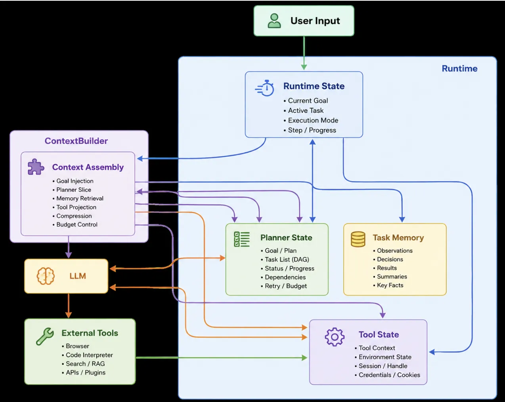

# 如何组织记忆上下文



我们的项目是通过promptctx包构建System Prompt，职责是：每轮 LLM 推理之前，按当前 Mode 编排出"喂给模型的 System Prompt 前缀"。拒绝字符串之间拼接。

## 拼接流程
```plain
用户输入 ──► agent ──► ContextAssembler.Assemble(Query{Mode})
                                │
                                ├─ 1. 选 Schema（chat / tool / rag / react）
                                ├─ 2. 并发调用 6 类 ContextSource 填充槽位
                                ├─ 3. 单槽位 TokenBudget 裁剪
                                └─ 4. 全局 budget 按 slotPriority 倒序裁剪
                                ▼
                  RuntimeContext.Render() ──► System Prompt 前缀 ──► LLM
```

## 核心概念
### SlotKind六种槽位
```go
const (
	SlotProfile     SlotKind = "profile" 
	SlotPlanner     SlotKind = "planner"
	SlotTaskMem     SlotKind = "task_memory"
	SlotToolState   SlotKind = "tool_state"
	SlotConstraints SlotKind = "constraints"
	SlotRecall      SlotKind = "recall_memory"
)
```

其中六种槽位代表含义如下：

```markdown
SlotProfile      用户画像（稳定身份 / 偏好）
SlotPlanner      任务规划状态（阶段 / 进度 / 下一步）
SlotTaskMem      当前任务的步骤观察缓冲
SlotToolState    可用工具 + 近期调用记录
SlotConstraints  沙箱政策 / 硬性安全约束
SlotRecall       兜底语义召回（episodic / fact / general）
```

### SlotFilter含义
```go
// SlotFilter 描述 Source 在填充槽位时的过滤约束
type SlotFilter struct {
    Categories  []string // 命中其一即可，空表示不限
    RequireTags []string // 必须全部包含
    MinScore    float64  // 召回综合分阈值
    TopK        int      // 单槽位最多返回项数（0 表示不截断）
    MaxAgeHours int      // 最大年龄（小时），0 表示不限
    TokenBudget int      // 单槽位字符预算（粗略以字符数近似 token）
}
```


### RuntimeContextSchema：Mode 与槽位编排表
| Mode | Constraints | Profile | Planner | TaskMem | ToolState | Recall |
| --- | :---: | :---: | :---: | :---: | :---: | :---: |
| **chat** | ✓ | ✓ | — | — | — | ✓ |
| **tool** | ✓ | ✓ | — | — | **必填** | ✓ |
| **rag** | ✓ | ✓ | — | — | — | ✓ |
| **react** | **必填** | ✓ | **必填** | ✓ | **必填** | ✓ |


未知 Mode 自动 fallback 到 chat 做兜底。

例子：

```go
// ReactSchema 多步推理：装配全部 5 类槽位
var ReactSchema = RuntimeContextSchema{
	Mode: "react",
	Slots: []Slot{
		{
			Kind:     SlotConstraints,
			Required: true,
			Filter:   SlotFilter{TokenBudget: 280},
		},
		{
			Kind:     SlotPlanner,
			Required: true,
			Filter:   SlotFilter{TokenBudget: 300},
		},
		{
			Kind:     SlotTaskMem,
			Required: false,
			Filter:   SlotFilter{TokenBudget: 350, TopK: 8, MaxAgeHours: 24},
		},
		{
			Kind:     SlotToolState,
			Required: true,
			Filter:   SlotFilter{TokenBudget: 350, TopK: 8},
		},
		{
			Kind:     SlotProfile,
			Required: false,
			Filter: SlotFilter{
				Categories:  []string{"identity", "preference"},
				TokenBudget: 250,
				TopK:        6,
			},
		},
		{
			Kind:     SlotRecall,
			Required: false,
			Filter: SlotFilter{
				Categories:  []string{"episodic", "fact", "general", "tool_failure"},
				TopK:        2,
				MinScore:    0.5,
				TokenBudget: 200,
			},
		},
	},
}
```

###  ContextSource：槽位数据提供者
```go
type ContextSource interface {
    ID() string
    Supports(SlotKind) bool
    Fetch(ctx context.Context, slot Slot, q Query) ([]ContextItem, error)
}
```

+ 一个 source 可支持多个 SlotKind（如 GraphMemory 同时填 Profile/Recall）
+ 各 source 独立可测，按 SlotKind 注册到SourceRegistry

## 装配核心流程
```go
func (a *ContextAssembler) Assemble(ctx context.Context, q Query) *RuntimeContext {
    schema := a.schemas[q.Mode]            // ① 选 Schema（fallback chat）
    rc := &RuntimeContext{Schema: schema, Filled: make([]FilledSlot, len(schema.Slots))}

    // ② 并发填充各槽位
    var wg sync.WaitGroup
    for idx, slot := range schema.Slots {
        wg.Add(1)
        go func(idx int, slot Slot) {
            defer wg.Done()
            rc.Filled[idx] = a.fillSlot(ctx, slot, q)   // 内部按 TokenBudget 裁剪
        }(idx, slot)
    }
    wg.Wait()

    // ③ 全局预算超限 → 按 priority 从低到高裁剪
    a.applyGlobalBudget(rc)
    return rc
}
```

双层 Budget 控制

+ **单槽位 budget**：source 自治，超额自动截断
+ **全局 budget**：默认2400字符，超限按优先级裁剪：

```go
// slotPriority 决定全局预算超限时的裁剪优先级（数字越小越优先保留）
func slotPriority(kind SlotKind) int {
    switch kind {
        case SlotConstraints:
        return 0
        case SlotPlanner:
        return 1
        case SlotTaskMem:
        return 2
        case SlotToolState:
        return 3
        case SlotProfile:
        return 4
        case SlotRecall:
        return 5
    }
    return 99
}

```

保证安全约束的优先级最高，永远在提示词中不丢失。

##  渲染
rc.Render() 把 FilledSlot 渲染为 zh-CN System Prompt 前缀：

```plain
【硬性约束】
- [禁止] 不允许执行 rm -rf
- [告警] 网络访问需要审批

【任务规划】
- 任务 t-001 状态=running 阶段=executing
- 进度：第 2/5 步
- 下一步：调用 weather_api（工具=http_get）

【可用工具】
- get_time — 获取当前时间
- weather_api — 查询天气（必填 city）
- 近期调用 weather_api [成功]: {"temp":22}

【用户画像】
- 城市: 北京
- 语言: 中文
- 用户叫张三

【相关回忆】
- 上次问过天气API（重要性=0.70, 综合分=0.82）
```

+ Skipped 或 Items 为空的槽位不渲染。

## 与"普通字符串拼接"的差异
| 维度 | 普通做法 | promptctx |
| --- | --- | --- |
| 组织方式 | 按数据类型（history/docs/tools） | 按**认知槽位**（profile/planner/...） |
| Mode 区分 | 一套 prompt 走天下 | Schema 驱动，4 Mode 各取所需 |
| 召回策略 | Top-K 全塞 | SlotFilter 声明式过滤 |
| 预算控制 | 估个总长度截断 | **双层 budget + 优先级裁剪** |
| 安全约束 | 可能被截断丢失 | Constraints 优先级 0，永不丢 |
| 数据获取 | 串行 | **goroutine 并发** |
| 可测试性 | 拼好的字符串难断言 | 每个 source 独立单测 |


## 主流程的使用
### 装配阶段（agent 启动时一次）
```go
reg := promptctx.NewSourceRegistry()
reg.Register(promptctx.NewProfileSource(pref, ltm))
reg.Register(promptctx.NewConstraintsSource(sandbox.PolicySnapshot()))
reg.Register(promptctx.NewRecallSource(ltm))   // 或 graphMem，实现 Recaller 即可
reg.Register(promptctx.NewToolStateSource(toolRegistry, toolTracker))
reg.Register(promptctx.NewTaskMemSource(taskMemBuf))
reg.Register(promptctx.NewPlannerSource(plannerProvider))

asm := promptctx.NewAssembler(promptctx.DefaultSchemas(), reg)
```

### 开始前注入
```go
// 装配 Schema-driven 上下文前缀 + 对话历史
memPrefix := a.buildContextPrefix(ctx, query, mode)
	
```

```go
func (a *UnifiedAgent) buildContextPrefix(ctx context.Context, query string, mode string) string {
	if a.pctx == nil {
		return ""
	}
	emb, _ := a.llm.EmbedContext(ctx, query)
	taskID := ""
	if t := a.currentTask(); t != nil {
		taskID = t.TaskID
	}
	return a.pctx.assemble(ctx, promptctx.Query{
		Text:      query,
		Embedding: emb,
		TaskID:    taskID,
		Mode:      mode,
	})
}

```

 

:::info
memPrefix 在每轮 ReAct 开始前装配一次、冻结复用；promptctx 内部缓冲区在循环中实时更新（任务步骤与工具调用结果），但这些更新会"延迟一轮"才出现在 prompt 里——属于跨轮次的短期工作记忆。

:::

## 总结
1. 避免上下文污染（最大的收益）
2. 恢复 Agent 状态，而不是恢复聊天记录
3. Token 利用率更高
4. 长任务能力更强
5. 让不同记忆有不同生命周期


> 更新: 2026-06-15 15:06:25  
> 原文: <https://www.yuque.com/yuqueyonghu-ng3vtk/agi-saber/sng79ezhasg971re>