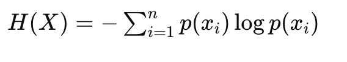
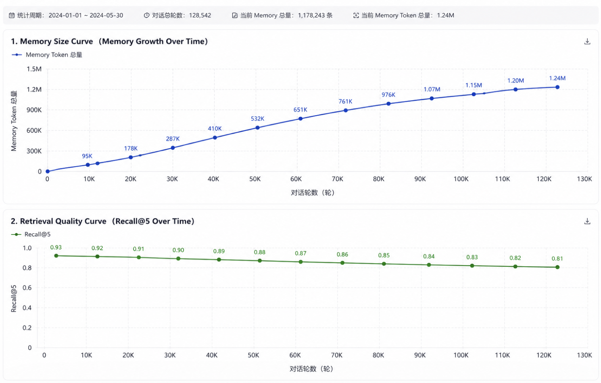

# 怎么评测记忆系统

# Memory System
```plain
记忆质量
+
记忆稳定性
+
长期一致性
+
上下文组织能力
```

---

# 一、记忆系统应该测哪几层


```plain
Store（该不该存）
Recall（能不能记起来）
Consolidation（记忆的熵增：记忆会不会越来越乱）
Context Assembly(上下文组装是否合理：实质是prompt调优）
Graph Expansion（记忆关联是否合理）
```

# 二、五层评测体系
---

## 第一层：Store（该不该存）


**评测目标**

测试：

```plain
Fact Extraction
Dedup
Importance
```

是否正确。

---

**首先还是要构建测试集**

**该不该记这个问题要基于你想让用户记什么？**

**对于我们这个agi系统我们考虑下面四点**

**1. 是否长期稳定**

**2. 是否影响未来任务**

**3. 是否属于用户偏好/目标/技能**

**4. 是否具有长期学习价值**

****

**真实测试集：**

[附件: memory_store_eval_dataset_1000.csv](./attachments/trBRM0K3v8thKKgt/memory_store_eval_dataset_1000.csv)


**量化指标**

 Memory Precision

```plain
真正该存的 / 实际存入的
```

tp+fp：该存的+不该存的

fp：垃圾记忆，无价值记忆


Precision(清晰率）=tp/(tp+fp)


步骤：

### Step1
构建测试集

### Step2
调用记忆系统封装好的逻辑功能函数

memory.store()


统计存入的所有记忆数量：（tp+fp）

统计其中我们标注的应该被存入的记忆数量（tp）

计算 Precision(清晰率）=tp/(tp+fp)


## 第二层：Recall（能不能记起来）
调用记忆系统封装好的逻辑功能函数

memory.recall()

这里本质复用的还是RAG的检索逻辑，所以我们测的东西就是RAG测评里的检索的指标

[AGI项目的真实RAG评测](https://www.yuque.com/yuqueyonghu-ng3vtk/agi-saber/kg90qoh7vm8o79bg)

### recall@k
低的话可以做如下改进： 

1：query改写

2：不同记忆走不同索引。

例如：

```plain
project memory
profile memory
tool memory
```

### mrr
低的话

说明：

```plain
排序器不行
```

**1. Rerank**

**调整重排系数**

**2. 时间衰减**

**改变记忆片段的加权系数**

****

### 
## 第三层：Consolidation（记忆的熵增：记忆会不会越来越乱）
### 1:重复率
#### 业界标准测试方法：时间轴模拟（Time-based Simulation）
不是单轮测。

而是：


模拟用户长期聊天

例如：


1000轮

5000轮

10000轮


然后观察：


记忆质量


持续运行 memory.store()，用脚本调用的时候记得记忆日期的填写

时间设置为每天存10轮，存100天；

最后看存1000轮最后的数据；

首先是重复率

对最后剩余的所有记忆进行向量化，然后开始聚类，相似度大于90%视为重复

然后统计重复的记忆数量

#### 重复率=重复记忆/此时的所有记忆
### 记忆熵
方法

对memory topic分布：

做 entropy。

---

举例

---

好系统

topic集中：

```plain
AI
Infra
Go
Agent
```

entropy稳定。

---

坏系统

topic无限随机扩散：

```plain
炸鸡
天气
猫
股票
电视剧
```

entropy不断升高。

---

指标

Shannon Entropy：


最后看两个曲线

1. Memory Size Curve（记忆长度曲线）

```plain
memory规模
是否失控
```

---

2. Retrieval Quality Curve（检索质量曲线）

```plain
memory越来越多后
Recall质量是否下降
```

我们这个项目用脚本跑的真实曲线图：



## 第四层：Context Assembly(上下文组装是否合理：实质是prompt调优）
本质测：

```plain
“召回的memory，
是否真的对当前回答有帮助”
```

因为：

很多系统：

```plain
Recall很好
但Prompt里塞了一堆无关记忆
```

导致：

+  token浪费 
+  注意力污染 
+  回答跑偏 

---

指标：

### Context Precision
---

定义

```plain
真正有用的context/实际注入prompt的context
```

---

怎么测

---

用户query

```plain
帮我规划Go后端学习路线
```

---

系统注入：

```plain
1. 用户长期学习Go
2. 用户关注AI Infra
3. 用户喜欢结构化回答
4. 用户喜欢Fate动漫
5. 用户昨天吃了炸鸡
```

---

真正有用的：

```plain
1
2
3
```

---

无关context：

```plain
4
5
```

---

那么：

```plain
Context Precision
=
3 / 5
=
60%
```

---

如果指标低怎么改

改：

```plain
memory rerank
MMR去冗余
query rewrite
dynamic topk
```

## 第五层：Graph Expansion（记忆关联是否合理）
本质测：

```plain
“系统建立的记忆关联
是否正确”
```

也就是：

```plain
memory graph quality
```

---


### 指标：Edge Precision
---

定义

```plain
正确关联边/系统生成总边数
```

---

# 
怎么测

---

Memory

```plain
用户学习Go
用户研究Kubernetes
用户关注AI Infra
用户喜欢Fate
```

---

系统生成边

```plain
Go → Kubernetes ✅
Kubernetes → AI Infra ✅
Go → Fate ❌
```

---

那么：

```plain
Edge Precision=2 / 3=66%
```

---

如果指标低怎么改

改：

```plain
relation classifier
higher similarity threshold
taxonomy约束
path validation
```


# 


> 更新: 2026-05-25 00:23:57  
> 原文: <https://www.yuque.com/yuqueyonghu-ng3vtk/agi-saber/lwvzhyiowohhg2z0>