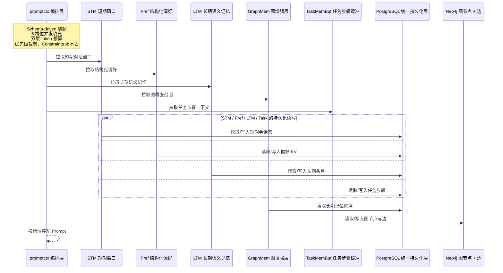
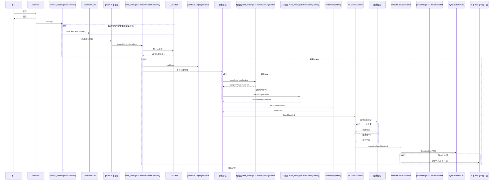

# 记忆系统详细介绍

# 一、整体架构



## 三、五种记忆形态

每种记忆形态对应不同的"使用模式"，不是把所有数据扔一个表。

### 3.1 ShortTerm（短期对话窗口）

**结构**：

```go
type ShortTerm struct {
    mu       sync.RWMutex
    Messages []ConversationMessage
    MaxTurns int
}
```

**机制**：固定窗口，超 MaxTurns × 2 条丢弃最早记录：

```go
func (m *ShortTerm) Add(role, content string) {
    m.mu.Lock(); defer m.mu.Unlock()
    m.Messages = append(m.Messages, ConversationMessage{Role: role, Content: content, ...})
    max := m.MaxTurns * 2
    if len(m.Messages) > max {
        m.Messages = m.Messages[len(m.Messages)-max:]
    }
}
```

### 3.2 Preference（结构化偏好）

**结构**：

```go
type Preference struct {
    mu   sync.RWMutex
    Data map[string]string  // 姓名/喜好/城市 等
}
```

**双通道写入**：

1. **规则路（同步、零延迟）**：

```go
if strings.Contains(msg, "我叫") {
    key, value = "姓名", strings.TrimSpace(parts[1])
    p.Data[key] = value; return key, value, true
}
```

2. **LLM 路（异步、准确）**——在 extractMemoryFromReply 里调 LLM 抽 k-v JSON

**为什么两条通道**：

* 单 LLM 路：用户说完"我叫张三"立即问"我叫什么"——LLM 抽取还没完成，第二轮回答会"不知道"
* 单规则路：覆盖率窄，只能命中"我叫/我喜欢/我爱"几种
* 两条并行：规则保证**即时一致性**，LLM 保证**长尾覆盖率**

### 3.3 LongTerm（长期语义记忆）

**结构**：

```go
type Item struct {
    ID           int
    Content      string
    Importance   float64    // 0~1，越高越重要
    Embedding    []float64
    Score        float64    // 召回时的综合分（不持久化）
    CreatedAt    time.Time
    LastAccessed time.Time
    Category     string     // identity/preference/fact/episodic/tool_failure/policy/general
    Tags         []string
    SlotHint     string     // 建议归属的 SlotKind
}
```

**核心字段含义**：

* Importance是**召回的二级信号**（公式 s = sim*0.7 + Importance*0.3 ），随时间衰减
* Category 是**装配阶段的过滤维度**——让"用户身份"不会被"昨天聊过的菜谱"挤掉
* SlotHint 是**槽位归属建议**——promptctx 装配时按此分流

### 3.4 GraphMemory（图增强层）

**结构**：

```go
type GraphMemory struct {
    ltm         *longterm.LongTerm
    kg          *knowledge.KGStore
    neo         *pneo4j.Client
    simThresh   float64
    prevID      int          // 上一条记忆 ID（用于 FOLLOWS 边）
    protectOnce sync.Once    // ProtectFn 钩子只挂一次
}
```

**Neo4j 节点**：`(:Memory {mem_id, content, importance})`\
**边类型**：

* FOLLOWS ：时序相邻（前一条 → 当前）
* SIMILAR\_TO ：写入时实时计算 Cosine ≥ simThresh 自动建

**关键能力**：

* **1-hop 图扩展**：召回时不仅返回向量命中条目，还沿边扩 1 跳
* **图中心度合并保护**：入度 ≥3 的节点免于淘汰

### 3.5 TaskMemBuffer（任务步骤环形缓冲）

**结构**：

```go
type TaskMemBuffer struct {
    mu  sync.RWMutex
    buf []StepObservation
    max int                  // 默认 20
}
```

**生命周期**：跟 ReAct 任务绑定。新任务开始时 Reset() 清空，任务步骤执行后 Push() 追加。

**为什么独立**：任务级步骤观察（"调了 weather\_api 返回 22℃"）和长期记忆（"用户偏好咖啡"）是**两种生命周期完全不同**的东西。混存会出现"任务结束后步骤观察污染长期召回"。

***

## 四、写入链路

### 4.0 长期记忆到底怎么写入

长期记忆的写入 = 用户消息或 assistant 回复 → 异步交给 LLM 抽 k-v → 抽到才拼短句 embed → 去重后同时写内存/图/PG 三层。原始输入永远不直接进长期记忆，抽不出 k-v 就等于什么都没发生

### 4.1 时序图



### 4.2 写入即分类（双通道分类管线）

**入口**：

```go
category, tags, slotHint := classifyMemoryContent(k, v)
if category == "" {
    category, tags, slotHint = a.llmClassifyMemory(content)
}
```

**规则层**：

```go
switch {
case containsAny(combined, "叫", "名字", "姓名", "是我", "我是"):
    return "identity", []string{"name"}, "profile"
case containsAny(combined, "喜欢", "偏好", "习惯", "爱好", "讨厌", "不喜欢"):
    return "preference", []string{"preference"}, "profile"
case containsAny(combined, "工具", "失败", "错误", "报错", "异常"):
    return "tool_failure", []string{"tool", "error"}, "tool_state"
case containsAny(combined, "禁止", "不要", "不能", "必须", "强制"):
    return "policy", []string{"constraint"}, "constraints"
default:
    return "", nil, ""
}
```

**LLM 兜底**：调一次 LLM 返回 JSON `{category, tags, slot_hint}`，失败回落到general。

**为什么必须分类**：

* 没有分类：召回阶段只能用 Top-K，"用户姓名"和"上次讨论的菜谱"按相似度竞争。如果当前问题是"做菜"，姓名信息会被排到 K 之外
* 有分类：身份信息走 FilterByCategory(\["identity"]) **不算相似度**，episodic 走 RecallByFilter(Categories=\["episodic"]) **算相似度**——两路互不干扰

### 4.3 写入去重（隐式合并）

```go
if m.consolidationCfg != nil && len(m.Items) > 0 && len(embedding) > 0 {
    for i := range m.Items {
        if len(m.Items[i].Embedding) == len(embedding) {
            sim := Cosine(embedding, m.Items[i].Embedding)
            if sim >= m.consolidationCfg.DedupThreshold {  // 默认 0.95
                if importance > m.Items[i].Importance {
                    m.Items[i].Importance = importance     // 取 max
                }
                m.Items[i].LastAccessed = time.Now()
                if category != "" && (m.Items[i].Category == "" || m.Items[i].Category == "general") {
                    m.Items[i].Category = category          // 类别升级
                }
                if slotHint != "" && m.Items[i].SlotHint == "" {
                    m.Items[i].SlotHint = slotHint          // SlotHint 仅空时填
                }
                if len(tags) > 0 {
                    m.Items[i].Tags = mergeTags(m.Items[i].Tags, tags)  // 标签合并
                }
                return false  // 不新增条目
            }
        }
    }
}
// 未命中才走 append 新增
```

**设计意图**：

* 去重不是"丢弃"，而是"加固"——多次提到的事实自然 Importance 累积
* 类别升级遵循"具体战胜泛化"—— general 永远会被更具体的类别覆盖
* 写入期就做去重，避免依赖 Consolidate 的 O(n²) 后处理

### 4.4 异步建图

**入口**：

```go
if gm.neoAvailable() {
    goSafe("graphmem.store-node", func() {
        gm.upsertMemoryNode(newID, content, importance)
        if gm.prevID >= 0 {
            gm.addMemoryEdge(gm.prevID, newID, "FOLLOWS", 1.0)
        }
        gm.linkSimilarEdges(newItem, newID)
    })
}
```

linkSimilarEdges ：扫最近 50 条记忆，对 Cosine ≥ simThresh 的建 SIMILAR\_TO 边。

**为什么异步 + 限 50 条**：

* 异步：不让 Neo4j 写入阻塞主链路
* 限 50：避免新记忆插入时全表扫描；时序相邻的记忆相似性最高

***

## 五、召回链路

### 5.1 三种召回策略对应三类槽位

| 槽位 | 召回方式 |
| --- | --- |
| **Profile** | 按 Category 枚举，**不算相似度** |
| **Recall** | 向量 + TF 兜底 + 1-hop 图扩展 |
| **TaskMem** | ring buffer 取最近 K |

身份信息走纯枚举——你的名字不会因为这轮问题不相关就被排到 TopK 之外。

### 5.2 召回综合分公式

```go
s := sim*0.7 + m.Items[i].Importance*0.3
```

**为什么权重这样分**：

* 相似度（0.7）是主信号：用户问"我喜欢什么"，必须召回"喜欢咖啡"而不是"喜欢早起"
* 重要性（0.3）是次信号：相同语义下，重要的优先；让指数衰减真正影响召回结果
* 不让 Importance 主导（避免老旧的高 importance 永远霸榜）

### 5.3 SlotFilter 声明式过滤

**结构**：

```go
type RecallFilter struct {
    Categories  []string  // 命中其一即可
    RequireTags []string  // 必须全部包含
    MinScore    float64   // 综合分阈值
    TopK        int       // 截断
    MaxAgeHours int       // 年龄硬过滤
}
```

**主循环**：

```go
for i := range m.Items {
    if len(filter.Categories) > 0 && !containsString(filter.Categories, m.Items[i].Category) {
        continue   // 类别过滤
    }
    if len(filter.RequireTags) > 0 && !containsAllTags(m.Items[i].Tags, filter.RequireTags) {
        continue   // 标签过滤
    }
    if filter.MaxAgeHours > 0 && now.Sub(m.Items[i].CreatedAt).Hours() > float64(filter.MaxAgeHours) {
        continue   // 年龄过滤（注意：和衰减是两回事）
    }
    // ... 算 sim 和综合分 s
    if s >= threshold {
        m.Items[i].LastAccessed = now
        items = append(items, scored{item: m.Items[i], s: s})
    }
}
```

**注意点**：

* MaxAgeHours 是"年龄硬过滤"，按 CreatedAt 截断；Importance 衰减是软信号——两者互补
* 召回时\*\*刷新 LastAccessed \*\*——访问触达即"重新激活"，间接保护活跃记忆不被合并/淘汰

### 5.4 1-hop 图扩展

**GraphMemory.RecallByFilter**：

1. 调底层 ltm.RecallByFilter 拿 seed
2. expandMemoryNeighbors(seedIDs, 1) 走 Neo4j

**Cypher**：

```cypher
MATCH (m:Memory) WHERE m.mem_id IN $ids
MATCH (m)-[:FOLLOWS|SIMILAR_TO|CAUSES|BELONGS_TO*1]-(n:Memory)
WHERE NOT n.mem_id IN $ids
RETURN DISTINCT n.mem_id AS id
```

3. 扩展条目固定打 Score = 0.45——能进 prompt 但不会压过强相关命中
4. 合并去重 + 排序 + TopK 截断

**设计意图**：图扩展是"主动联想"——用户问"上次的咖啡"，向量召回拿到"喜欢咖啡"，图层补回时序相邻的"昨晚熬夜了"——发现间接关联但不直接相似的历史。

***

## 六、合并链路（衰减/去重/合并/过期）

这是整个记忆系统**最复杂、最关键**的部分。Consolidate 是**四阶段管线**。

### 6.1 触发器

**NeedConsolidation**：

```go
return m.consolidationCfg != nil &&
    m.consolidationCfg.TriggerInterval > 0 &&
    m.storeCount >= m.consolidationCfg.TriggerInterval   // 默认 5
```

**调用点**：

```go
a.goSafe("process.consolidate", func() {
    if a.mem.ltm.NeedConsolidation() {
        var result longterm.ConsolidationResult
        if a.mem.graphMem != nil {
            result = a.mem.graphMem.GraphAwareConsolidate()
        } else {
            result = a.mem.ltm.Consolidate()
        }
        a.syncConsolidationToDB(result)
    }
})
```

**为什么计数触发而非定时**：

* 低活跃期不空转
* 高活跃期及时清理，防止重复条目堆积
* 异步执行不阻塞用户响应

### 6.2 Phase 1：指数衰减

**代码**：

```go
const minDecayDelta = 0.01
for i := range m.Items {
    days := time.Since(m.Items[i].CreatedAt).Hours() / 24
    oldImp := m.Items[i].Importance
    newImp := oldImp * math.Pow(m.consolidationCfg.DecayRate, days)
    m.Items[i].Importance = newImp
    if oldImp-newImp >= minDecayDelta {
        result.DecayUpdates = append(result.DecayUpdates, DecayUpdate{
            ID:         m.Items[i].ID,
            Importance: newImp,
        })
    }
}
```

**关键设计点**：

1. **按 CreatedAt 计算而非"上次衰减时间"**——幂等，重复跑不会累积错误
2. **0.995^days 是日衰减系数**——30 天 ≈ 86%，100 天 ≈ 61%
3. \*\*Δ ≥ 0.01 才入 DecayUpdates \*\*——控制 PG 写放大；变化太小不值得 UPDATE

### 6.3 Phase 2：去重 + 合并（双阈值分流）

**代码**：

```go
sim := m.itemSimilarity(m.Items[i], m.Items[j])

if sim >= m.consolidationCfg.DedupThreshold {        // ≥0.95
    // 去重：保留 importance 高的
    if m.Items[j].Importance >= m.Items[i].Importance {
        removed[i] = true; result.Deduped++
        result.DeleteFromDB = append(result.DeleteFromDB, m.Items[i].ID)
    } else {
        removed[j] = true; result.Deduped++
        result.DeleteFromDB = append(result.DeleteFromDB, m.Items[j].ID)
    }
} else if sim >= m.consolidationCfg.SimilarityThreshold {  // 0.80~0.95
    // 合并：mergeItems
    merged := m.mergeItems(m.Items[i], m.Items[j])
    m.Items[i] = merged
    removed[j] = true; result.Merged++
    result.DeleteFromDB = append(result.DeleteFromDB, m.Items[j].ID)
    result.UpdateInDB = append(result.UpdateInDB, merged)
}
```

**mergeItems 细节**：

* 主体：Importance 高的为 base
* Importance ：取 max
* Content ：子串关系取长，否则 ； 拼接
* Embedding ：**按 Importance 加权平均**
* LastAccessed ：刷新到 now

**为什么合并不调 LLM**：

* 确定性、低延迟、可单测
* LLM 改写在大规模下成本爆炸
* 缺点：长期演进会出现"用户偏好咖啡；用户喜欢拿铁"的累积——可演进为 LLM rewriter

### 6.4 Phase 3：双门槛过期淘汰

**代码**：

```go
days := time.Since(m.Items[i].CreatedAt).Hours() / 24
if m.consolidationCfg.TTLDays > 0 &&
    days > float64(m.consolidationCfg.TTLDays) &&
    m.Items[i].Importance < m.consolidationCfg.MinImportance {
    removed[i] = true
    result.Expired++
    result.DeleteFromDB = append(result.DeleteFromDB, m.Items[i].ID)
}
```

**双门槛 AND 关系**：

* 必须同时 days > TTLDays(30) AND Importance < MinImportance(0.3) 才删
* **"老但仍重要"被永久保留**——这是真正的设计意图
* TTL 不是单方面"到期就删"

##


> 更新: 2026-07-01 21:43:35  
> 原文: <https://www.yuque.com/yuqueyonghu-ng3vtk/agi-saber/qwsuulxsongrhiak>
