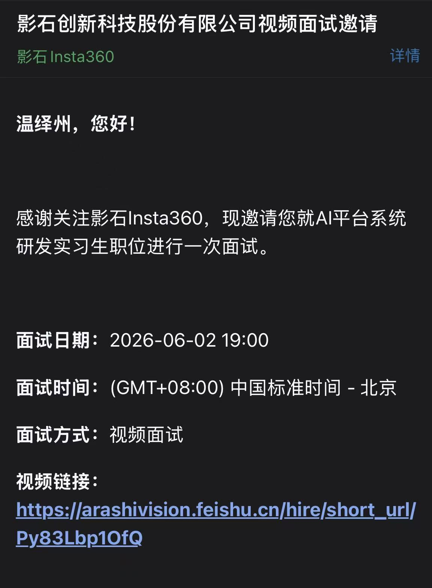

# 影石1面

# 面邀截图

# 问题

## q1:对于这个项目你做过功能测试吗？出现过棘手的bug吗？你怎么解决的？

我主要测试：1:RAG召回准确率，2:Agent react执行工具调用，3.长期记忆系统

其中最棘手的Bug出现在记忆系统的记忆污染

使用测试脚本模仿用户长期多轮对话，后面会出现明显的幻觉记忆现象

原因：

单纯的事实合并，多轮合并会出现幻觉summary

解决方式：

fact合并后不直接删除，fact只依赖时间重要性自动删除，不能通过自动合并删除

通过召回summary去寻找fact，然后注入槽位时候注入fact

## q2:讲一下你觉得agent什么时候有必要有记忆？

我觉得是两个点：

1:是否有跨会话场景

2:是否需要用户个性化画像

## q3:为什么claude code这种coding agent用grep而不用向量检索呢？

1:首先向量检索是存在不精确性的，而代码改动这种工作又不允许幻觉和黑盒，coding agent中可靠性大于一切，grep的精确性是coding agent所需要的，文本检索是 100% 精确的匹配。配合正则表达式（如 `grep "class .*Service"`），Agent 可以像手术刀一样精准定位到类声明、函数调用或某个具体的变量名。

2:grep的速度跟向量检索的速度完全不是一个量级

3:代码的密度极高。向量检索通常需要把代码切成固定大小的“块”（Chunk），这很容易把一个完整的函数切断，或者带入大量无关的上下文。 而 `grep` 配合参数（如 `rg -C 5` 显示匹配行的前后 5 行），可以让 Agent 极其精准地只把最核心的几行代码塞进 Prompt 里，避免了大量无用代码挥霍大模型的上下文窗口（Context Window）和 Token 成本

## q4:你这个项目的记忆去重怎么做的？

**1:hash去重**

对于完全相同的事实，再次提取出来时。

直接计算hash值，如果Hash一致，不再存取。

**2:语义去重**

很多重复信息并不是文本完全一致。，但本质同一个事实。所以我们要Embedding该提取出来的记忆。

然后在Memory Store中做相似度搜索。如果有相似度超过0.95的则认为是同一事实。不再存取。

**3:合并**

后台零点会自动跑定时任务，把语义相似度高的记忆chunk合并成一个chunk。

## q5:你不是有语义去重吗，那你那个合并有用吗？

语义去重主要解决“完全重复事实”的问题，阈值通常比较高，我这个项目是0.95，避免同一条记忆被反复写入。而Consolidation解决的是长期运行后产生的大量主题相近但不完全相同的记忆碎片，例如“学习Go”、“研究Gin”、“开发Go项目”，它们并不重复，我这个项目设置的阈值是0.85，但都属于同一个知识主题。通过定期合并，可以把碎片化事实抽象成更高层次的用户画像，实现记忆压缩和知识演化，两者目标不同。

## q5:这个项目如果让你再做一次，你最想重构什么？

我最想重构记忆系统长期记忆这一块，因为通过我的调研，claude code，codex，opencode这类产品对于长期记忆的实现都偏向文件系统管理的感觉，我想重新以这个方向试一下。

> 更新: 2026-06-15 17:06:50  
> 原文: <https://www.yuque.com/yuqueyonghu-ng3vtk/agi-saber/ng54h0ilia3uegeq>