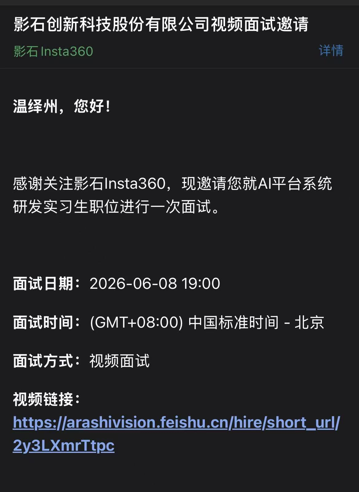

# 影石2面

# 面邀截图
# 问题:
因为2面聊的时间较少，跟项目有关的我觉得就两个问题：

**q1:你觉得你这个项目，哪里最有挑战性？**

**这个我回答特别不好，大家可以想下怎么回答这类型问题**

**q2:我们这里主要是做数据湖的数据开发工作，举一个场景，假如我们有一个几亿数据的文件，能直接上传到你的这个项目里，然后说帮我做某某方面的数据处理，你觉得你的项目能够完成这个任务吗？**

本质上并不是agent能不能处理，而是agent能不能选择能够解决该场景的工具，据我所知，如果有一种mcp工具是接入spark的计算型数据开发工具，然后接入到我这个项目里之后，如果决策应该调用它的时候，那么大概率就会成功。

> 更新: 2026-06-15 18:10:39  
> 原文: <https://www.yuque.com/yuqueyonghu-ng3vtk/agi-saber/kpvv6yealfaeog71>